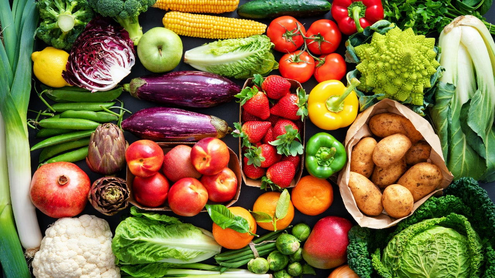
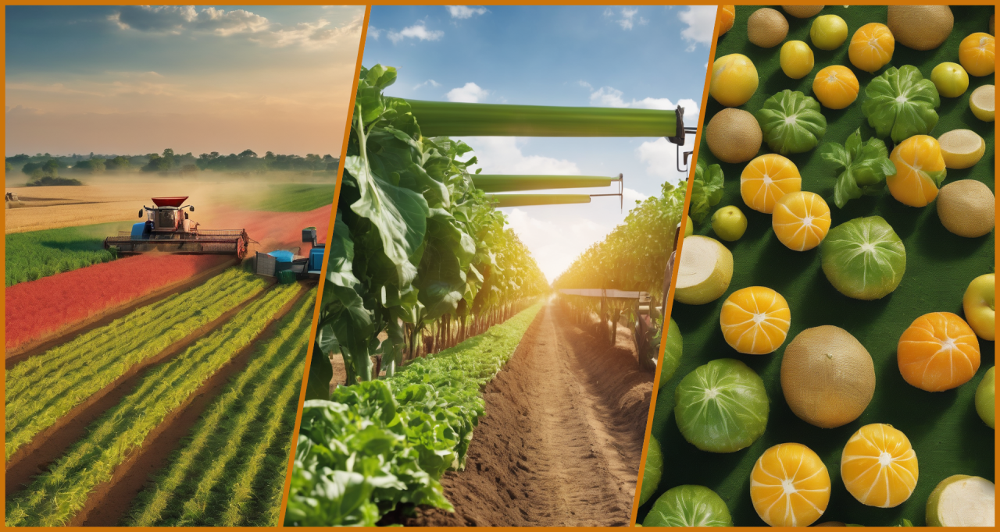

# **FRESHCYCLE**

A Simple, Smart Way to Reduce Food Waste and Help Farmers Earn More.

FreshCycle is a mobile app that helps small farmers sell their produce before it spoils. It is a rule-based aggregation and coordination platform designed to reduce post-harvest losses among African smallholder farmers.
By pooling small produce volumes into bulk lots and matching them with buyers before spoilage occurs, FreshCycle improves farmer income, enhances market transparency, and enables circular economy practices in agriculture. 

Simpy put FreshCycle solves the problem by:

- Combining (aggregating) produce from many small farmers
- Creating large bulk lots
- Matching those bulk lots with buyers
- Coordinating logistics quickly
- Redirecting surplus produce before it spoils

## MVP Goal

Validate that smart aggregation and coordinated matching can reduce post-harvest loss by at least 15% within 30 days in one pilot region.

## Key Features of FreshCycle

1. Smart Produce Listing
Farmers easily list crop type, quantity, harvest date, and grade via mobile app.

2. Rule-Based Aggregation Engine
Automatically combines small volumes from nearby farmers into bulk lots (≥500kg) to meet buyer requirements.

3. Shelf-Life Risk Detection
Calculates spoilage risk and prioritizes near-expiry produce for faster sale or redirection.

4. Buyer Marketplace
Buyers browse aggregated bulk lots by crop, location, volume, and risk level, then place orders instantly.

5. Automated Logistics Alerts
Transport providers receive real-time pickup notifications and confirm collection and delivery within the system.

## Project Structure 

FreshCycle follows a **modular, role-based architecture** designed for scalability, clarity, and separation of responsibilities.

The system is divided into four main layers:

### Frontend
This is what users interact with.nIt includes:

#### Farmer Interface

* Registration
* Produce listing
* Market price view
* Order tracking
* Pickup notifications

#### Buyer Interface

* Bulk lot browsing
* Filtering (crop, location, risk level)
* Order placement
* Delivery tracking

#### Logistics Interface

* Pickup alerts
* Route and batch details
* Collection confirmation
* Delivery confirmation

#### Admin Dashboard

* User approvals
* Aggregation monitoring
* Spoilage risk overview
* Metrics dashboard
* Dispute resolution

Design Principles:

* Mobile-first
* Low bandwidth optimized
* Simple UI
* SMS fallback integration

# Backend
This is the “brain” of the system.It contains:

#### Aggregation Engine

Groups produce by:

* Crop type
* Grade
* Geo-location (≤20km)
* Threshold (≥500kg)

Creates bulk lots automatically.

#### Spoilage Risk Engine

Calculates:
Days Left = Shelf Life – (Current Date – Harvest Date)

Flags:

* At-risk produce
* Priority routing to processors

#### Matching Engine

Matches:

* Bulk lots → Buyers
* At-risk produce → Processors
* Confirmed orders → Logistics

#### Notification Service

Sends:

* SMS alerts
* App notifications
* Pickup alerts
* Order confirmations

#### Scoring & Rating Module

Maintains:

* Farmer scores
* Buyer reliability scores
* Badge levels

# Data Layer (Database & Storage)

Responsible for storing system data securely. Includes:

* User accounts (farmers, buyers, logistics, admin)
* Produce listings
* Bulk lot records
* Orders & transactions
* Logistics records
* Risk scores
* Ratings & performance data

Requirements:

* Cloud-based storage
* Encrypted data in transit
* Role-based access control

#### Future: Mobile Money APIs

For payment processing.

#### Cloud Hosting Infrastructure

For scalability and uptime (80% target).

## System Workflow Interaction

All layers work together as follows:

User Action (Frontend)
→ Business Logic Processes Rules
→ Database Updated
→ Notifications Triggered
→ External Services Engaged (SMS/Mapping)

Everything is automated except:

* Admin overrides
* Manual dispute resolution

##  Architectural Principles

FreshCycle is built on:

* Modular design
* Rule-based automation
* Mobile-first architecture
* Low-bandwidth optimization
* Scalable cloud infrastructure
* Secure, role-based access

#  Deployment Structure (Conceptual)

The system can be deployed as:

*  Mobile application
* SMS-enabled system
* Cloud-hosted backend
* REST API-driven architecture

Designed to support:

* 5,000 concurrent users (pilot scale)
* Offline data entry with later sync
* Gradual regional expansion

